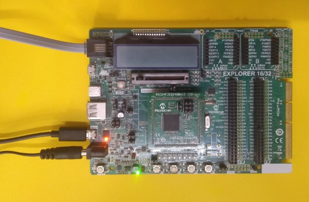
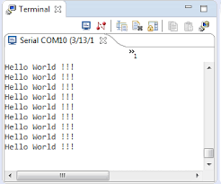

 

## PIC24F Hello World UART

## Summary

This is a simple Hello world application which prints the string "Hello World !!!" continuously on the serial terminal.

## Related Documentation

- PIC24FJ1024GB610 microcontroller (https://www.microchip.com/PIC24FJ1024GB610)

## Software Used 

- MPLAB® X IDE v5.35 or newer (https://www.microchip.com/mplabx)
- MPLAB® XC16 v1.50 or newer (https://www.microchip.com/xc) 
- Any of the serial terminal application. Example: Tera Term (https://ttssh2.osdn.jp/index.html.en)

## Hardware Used

- Explorer 16/32 Development Board (https://www.microchip.com/DM240001-2)
- PIC24FJ1024GB610 PIM (https://www.microchip.com/MA240023)
- Micro USB Cable

## Setup
- Make sure J37 and J38 jumpers are installed.
- Connect the Micro USB Cable to the serial connector(J40) in the Explorer 16/32 Development Board. 

## Operation

Build the Project and program the device. Once the application code is flashed on to the device, open the serial terminal application and configure the baudrate to 9600 , No parity , 8 Data bits and 1 Stop bit and no flow control.
Users will see the string "Hello World !!!" being continuously printed on the serial terminal.

