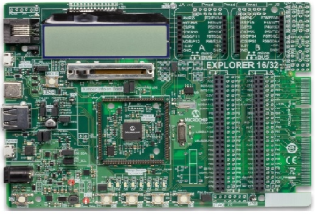

# pic24f-hello-world-uart

# Summary

This is the demo software which runs on Explorer 16/32 Development Board. The Explorer 16/32 Development Board is a cost-effective, fully integrated 
16-bit development platform targeted at first-time users, Makers, and those seeking a feature-rich rapid prototyping board. Refer to https://www.microchip.com/DevelopmentTools/ProductDetails/DM240001-2 for additional details about the board.

# Related Documentation

This is a simple Hello world application which prints the string "Hello World !!!" continuously on the serial terminal. 

# Software Used 

- MPLAB® X IDE v5.35 or newer (https://www.microchip.com/mplabx)
- MPLAB® XC16 v1.50 or newer (https://www.microchip.com/xc) 
- Any of the serial terminal application. Example: Teraterm(https://ttssh2.osdn.jp/index.html.en)

# Hardware Used

- Explorer 16/32 Development Board(https://www.microchip.com/DM240001-2)
- Micro USB Cable

# Setup

Connect the Micro USB Cable to the serial connector(J40) in the Explorer 16/32 Development Board. 

# Operation

Build the Project and program the device. Once the application code is flashed on to the device, open the serial terminal application and configure the baudrate to 9600 , No parity , 8 Data bits and 1 Stop bit and no flow control.
Users will see the string "Hello World" being continously printed on the serial terminal.

